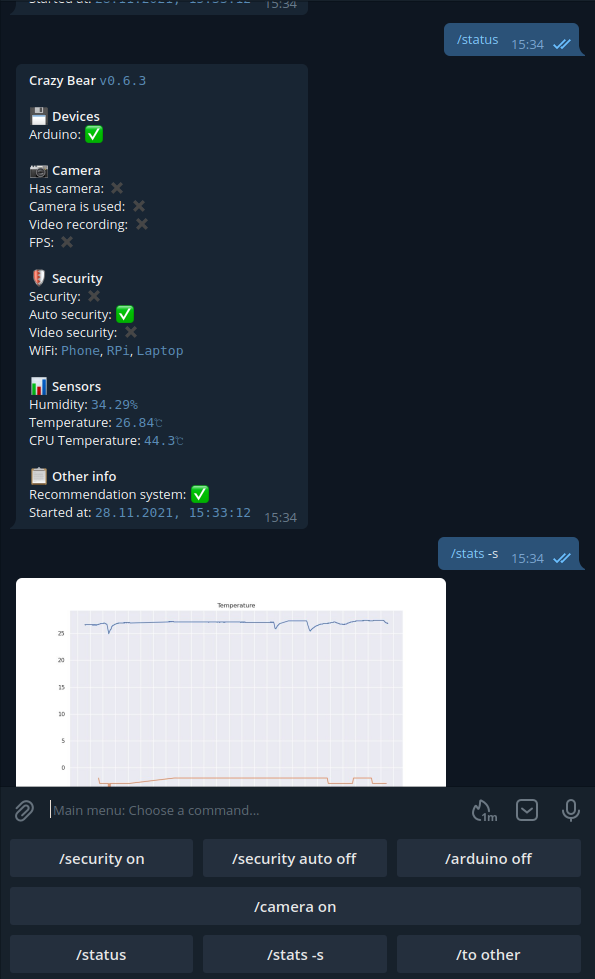
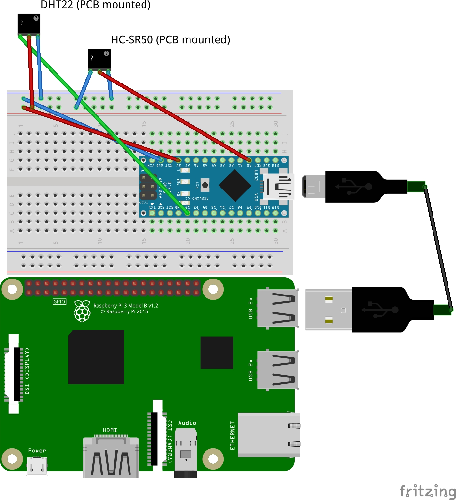

# CrazyBear - Home Assistant in Telegram

## Preview



## Scheme



## Used:
1. **Raspberry Pi 4**
2. **Arduino Nano V3.0 ATmega328P** (is connected via USB to a **Raspberry Pi**)
   1. **AM2302 DHT22**
   2. **HC-SR501**
3. **Logitech C270 HD** (is connected via USB to a **Raspberry Pi**)

## Setup

1. Create `prod.env` file in `./envs`. See `project/config/default.py`.

2. Copy the code to a **Raspberry Pi** (or somewhere else).

3. Build and run:
```bash
docker-compose build
docker-compose up -d
```

4. If you want to use Arduino then you need to upload `arduino_core`.
